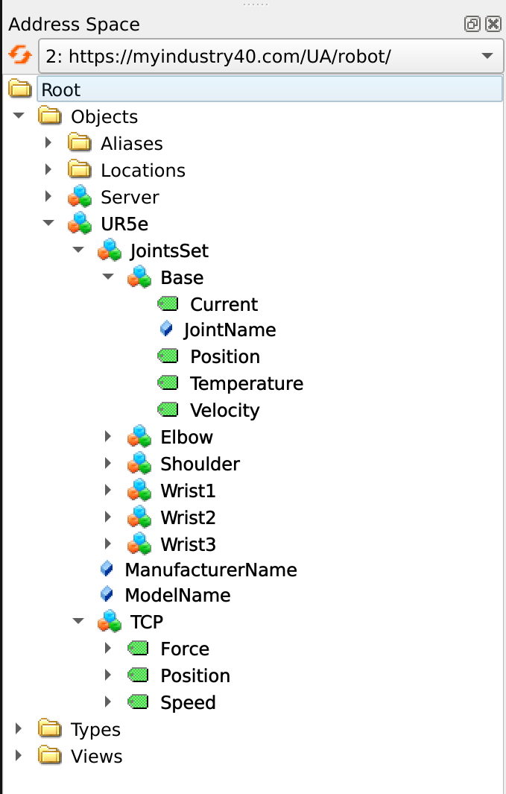

# opcua_rtde
This repository creates an OPC-UA server to share data of UR5e robot. The information model of the robot has been created and data of robot has been fed to the server through Real Time Data Echange (RTDE) library of Universal Robot.

The information model of robot can be written either (i) directly, using the tutorial provided by [Open62541 implementaion in C99](https://www.open62541.org/doc/v1.4.10/tutorial_server_object.html), you can find the ur5e model in robottype.h or (ii) writing the information model in the xml format and then using a model compiler to generate the nodeset2.xml format which can be used by the server. Below, the steps to compile the robotmodel.xml have been mentioned.


The writing of robotmodel.xml is adapted based on this [tutorial]( https://profanter.medium.com/how-to-create-custom-opc-ua-information-models-1e9a461f5b58).

In order to compile the robotmodel, the official OPC Foundation [UA-ModelCompiler](https://github.com/OPCFoundation/UA-ModelCompiler) has been used, you can download the docker file from here https://hub.docker.com/r/sailavid/ua-modelcompiler , then 

go to the 'configs' directory
```bash
cd opcua_ur_rtde/configs
```
and run 
```bash
sudo docker run \
	  --mount type=bind,source=$(pwd),target=/model/src \
	  --entrypoint "/app/PublishModel.sh" \
	  sailavid/ua-modelcompiler:opcua_rocks_tested \
	   /model/src/robotmodel robot /model/src/Published
```
Therefore, the corresponding robot.NodeSet2.xml has been generated and can be used to run your opcua server. It is noteworthy that you may need to take further steps depending on your server implementation vendors. 
Since we are using the open62541 implemetation of opcua, we proceed as followes:

Having the generated robot.NodeSet2.xml, one can use the node set compiler to get the C implementation of the robot model using open62541 node set compiler, see the [official tutorial](https://www.open62541.org/doc/v1.4.10/nodeset_compiler.html).

```bash
python3 ./nodeset_compiler.py --types-array=UA_TYPES --existing ../../deps/ua-nodeset/Schema/Opc.Ua.NodeSet2.xml --xml robot.NodeSet2.xml robot
```

The server from the generated header files has been started and using the UaExpert as a client you can see the information model of UR5e as below:

<p align="center">
  </a>
</p>